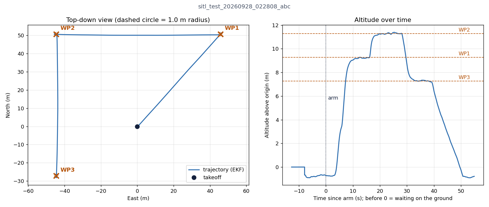

# ros2_ws — Role 1: Flight Control & Navigation

ROS 2 workspace for **Role 1** of the UAV team project (outdoor GPS waypoint navigation + obstacle avoidance on a ModalAI Starling 2 Max: VOXL 2, PX4, uBlox M10).

Role 1 delivers a ROS 2 node that makes PX4 fly to GPS coordinates: it reads GPS, converts target lat/lon to the local frame, streams position setpoints, switches to **Offboard**, and accepts each waypoint once the drone is within a radius. Everything goes over **MAVLink via MAVROS**, and is validated in PX4 SITL + Gazebo.

```
 gps_goto (this repo) ──ROS 2──► MAVROS ──MAVLink/UDP──► [mavlink-router / voxl-mavlink-server] ──► PX4
        ▲                           │
        └── /mavros/state, local_position, global_position, gpsstatus, gp_origin
```

## Status (2026-09-28)

| Item | Status |
|---|---|
| Fly to one GPS coordinate over MAVLink (SITL) | Done: error after hold ~0.3 m |
| Multiple waypoints A → B → C | Done |
| Milestone 1 (arm → takeoff → hover → move → land, 5 consecutive runs) | **5/5 passed** |
| Failsafe tests: node killed, pilot takeover, GPS loss | Done, all land safely |
| Through a MAVLink router (`mavlink-router`, stands in for `voxl-mavlink-server`) | Done |
| ROS 2 Foxy (target on VOXL 2) | Static checks pass; full run needs Docker (`docker/foxy/`) |
| Wind | Tried; wind model is not calibrated |
| Open question for Role 4 | Is "MAVLink routing" = node → MAVROS → `voxl-mavlink-server`? Which port on VOXL 2? |

Details and plots per flight: [`results/README.md`](results/README.md).



## Layout

```
ros2_ws/
├── src/
│   ├── uav_nav/                         Role 1 package: gps_goto node (MAVROS, Offboard, GPS → local, waypoints)
│   │   ├── uav_nav/gps_goto.py          main node + state machine
│   │   ├── uav_nav/geo.py               GPS ↔ NED (port of PX4 geo.cpp)
│   │   ├── config/gps_goto.yaml         1 waypoint
│   │   ├── config/gps_goto_abc.yaml     3 waypoints A → B → C
│   │   ├── config/mavlink-router-sitl.conf   router: PX4 → MAVROS + GCS (like voxl-mavlink-server)
│   │   ├── launch/gps_goto.launch.py    starts MAVROS (+ router) + gps_goto
│   │   ├── scripts/sitl_test.sh         automated headless SITL test: SCENARIO (faults), WIND, launch args
│   │   ├── scripts/milestone1.sh        N consecutive flights, writes SUMMARY.md
│   │   ├── scripts/plot_flight.py       plot trajectory from flight.ulg
│   │   ├── scripts/demo_up.sh           open demo windows: PX4+Gazebo, QGC, node, monitoring (`qos` = self-study demo)
│   │   ├── scripts/demo_down.sh         stop everything after a demo
│   │   └── test/                        unit tests: coordinate conversion + state machine (no SITL needed)
│   └── uav_practice/                    self-study: talker/listener, QoS experiment
├── sim/                                 x500 model with wind enabled + windy world (used with WIND=...)
├── docker/foxy/                         run uav_nav on ROS 2 Foxy (like VOXL 2); needs Docker
└── results/                             logs + plots of every SITL flight (index: results/README.md)
```

## Prerequisites

Tested on Ubuntu 22.04 with:

| Software | Version | Notes |
|---|---|---|
| ROS 2 | Humble | target on the drone is Foxy (see `docker/foxy/`) |
| PX4-Autopilot | v1.14.0 | SITL with Gazebo (`gz_x500`) |
| MAVROS | 2.15.1 | built from source (no `ros-humble-mavros` binary was available); needs GeographicLib datasets |
| mavlink-router | v4 | only for `router:=true` |
| QGroundControl | 5.0.8 | only for the GUI demo |
| Python | `pyulog`, `matplotlib` | only for `plot_flight.py` |

The scripts assume this layout (override with `PX4_DIR=...` where supported):

```
~/coding/tools/PX4-Autopilot                           PX4 source + SITL build
~/coding/tools/mavros_ws/install/setup.bash            MAVROS (sourced in ~/.bashrc)
~/coding/tools/mavlink-router/install/bin/mavlink-routerd
~/coding/ros2_ws                                       this repo
```

## Quick start

```bash
cd ~/coding/ros2_ws
source /opt/ros/humble/setup.bash
source ~/coding/tools/mavros_ws/install/setup.bash
colcon build --symlink-install
source install/setup.bash                 # in every new terminal

colcon test && colcon test-result         # unit tests + lint

# Fly to GPS coordinates in SITL (GUI)
(cd ~/coding/tools/PX4-Autopilot && make px4_sitl gz_x500)          # T1: PX4 + Gazebo
ros2 launch uav_nav gps_goto.launch.py config:=gps_goto_abc.yaml     # T2: A → B → C

# GUI demo (4 tabs: PX4+Gazebo, QGC, node, monitoring)
bash src/uav_nav/scripts/demo_up.sh       # afterwards: bash src/uav_nav/scripts/demo_down.sh

# Automated headless tests
bash src/uav_nav/scripts/sitl_test.sh                      # 1 waypoint (~1 min)
bash src/uav_nav/scripts/milestone1.sh 5                   # Milestone 1 (~5 min)
SCENARIO=gps_loss bash src/uav_nav/scripts/sitl_test.sh    # kill_node | mode_switch | gps_loss
WIND="3 0" bash src/uav_nav/scripts/sitl_test.sh           # East/North wind in m/s
bash src/uav_nav/scripts/sitl_test.sh router:=true         # through mavlink-router
```

If `mavros` is not found: make sure `~/coding/tools/mavros_ws/install/setup.bash` is sourced, open a new terminal and rebuild.

## gps_goto node

**State machine** (20 Hz):

```
WAIT_READY → PRE_STREAM → ENGAGE → TAKEOFF → GOTO → HOLD → (GOTO …) → LANDING → DONE
                            │         │        │                          (FINAL_HOLD if land_at_end=false)
                            │         └────────┴── GPS degraded / drift / timeout → LANDING
                            └── timeout while armed → DISARM → ABORT
 any flying state: lost Offboard (pilot takeover / PX4 failsafe) → ABORT, PX4 takes over
```

- **WAIT_READY**: MAVROS connected, pose + GPS received, 3D fix with horizontal accuracy ≤ `max_eph`. Requests PX4's EKF origin (`gp_origin`) and waits up to 5 s for it; falls back to the current position otherwise.
- **PRE_STREAM**: streams setpoints for 1 s (PX4 only enters Offboard once setpoints are flowing).
- **ENGAGE**: requests `OFFBOARD` then arm, retrying every second for up to 10 s.
- **GOTO / HOLD**: a waypoint is reached when within `acceptance_radius` horizontally and `acceptance_alt` vertically; the node then holds for `hold_time` and logs the GPS error.
- Waypoints are converted with the same azimuthal-equidistant projection as PX4 (`geo.py`), anchored at the EKF origin, so targets match PX4's local frame exactly. The node works in MAVROS ENU (x=East, y=North, z=Up).

**Parameters** (`config/*.yaml`):

| Parameter | Default | Meaning |
|---|---|---|
| `waypoints` | `[47.3982, 8.5462, 10.0]` | flat list `[lat, lon, alt_rel, …]`, `alt_rel` in m above the takeoff point |
| `takeoff_alt` | 5.0 | m, climb before heading to WP1 |
| `acceptance_radius` | 1.0 | m, horizontal |
| `acceptance_alt` | 1.0 | m, vertical |
| `hold_time` | 5.0 | s held at each waypoint |
| `wp_timeout` | 90.0 | s max per leg (and for takeoff) → land |
| `max_eph` | 3.0 | m, do not fly / land if GPS horizontal accuracy is worse |
| `max_drift` | 3.0 | m, horizontal drift during takeoff → land |
| `land_at_end` | true | land after the last waypoint, otherwise hold in Offboard |

**Launch arguments**: `config` (file in `config/`), `router` (`true` = go through mavlink-router), `fcu_url` (empty = chosen from `router`), `gcs_url`, `start_mavros` (`false` if MAVROS is already running), `router_bin`. When `gps_goto` exits, the whole launch (MAVROS, router) shuts down.

**Ports in SITL**: PX4 sends onboard MAVLink to UDP 14540. With `router:=false` MAVROS binds 14540 directly; with `router:=true` `mavlink-routerd` listens on 14540 and forwards to MAVROS (14640) and a second GCS (14551). QGC gets PX4 directly on 14550.

## Notes

- `GPSRAW.eph` is HDOP × 100, not meters; the node uses `h_acc` (mm) for GPS accuracy.
- PX4 SITL saves parameters to disk. A `gps_loss` test sets `SIM_GPS_USED=0`, which would persist; `sitl_test.sh` and `demo_up.sh` reset it to 10 on startup.
- `flight.ulg` files are excluded from git (≈300 MB); regenerate by re-running the tests.
